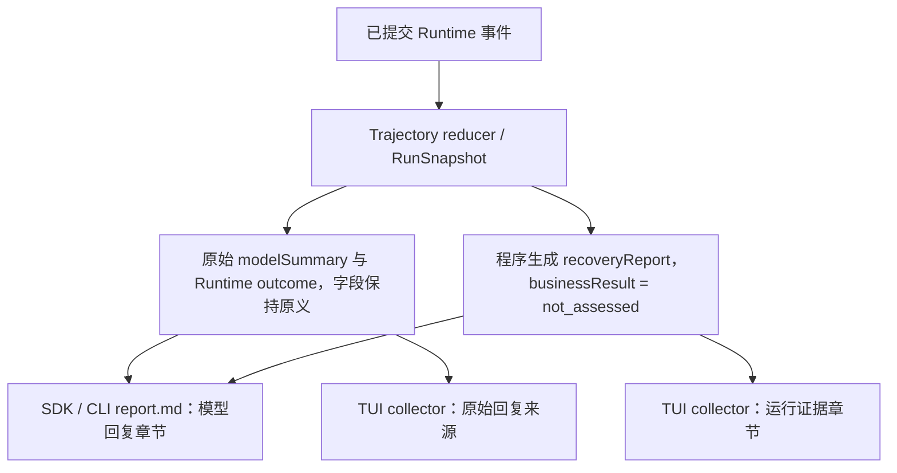

# 试点可靠性与阶段交付修复（2026-10-01）

状态：通用 Context 指导、程序运行证据报告和试点后续预算配置已实现。代码只经离线构建与 mock 回归；本轮没有实际模型、网站、桌面、VM 或整批试点运行。相关 CUA 观察恢复改动由并行实现者完成，仍未实机验收。

## 修复范围

本轮修复了两个相互补充的问题：模型回复没有交付时，Runtime 仍可能已经提交可引用的观察、错误、阶段状态和 Memory 状态；以及 GUI 输入发生后遇到失败或未知结果时，模型需要先重新观察，不能盲目重放。

共享执行指导放在默认 Context 的稳定 system 前缀，适用于 raw/recent 与 GLM/Qwen。它要求保留 Goal 范围和全部条件、不自行添加筛选条件；只陈述观察或可指明来源记录支持的结论，区分观察、推断、未知和阻塞；信息足够回答后即简洁交付；重复尝试没有进展时改换路径或报告证据缺口；可能已发送输入后先检查新观察，结果失败或未知时不盲目重放。精确观察时刻使用 Runtime 提供的 `capturedAt`；没有可用值时写 unknown，不通过系统时钟或授时网页补猜。

这些原则没有引入新的 Runtime 或 Protocol 字段。模块相关提示仍按原有 feature 开关生成；共享前缀本身不引用 Planning 或 Memory 专有功能。动态观察时刻与对应 Observation ID 一起附在最新截图消息中，不进入稳定前缀哈希；其文本 token 计入现有 Context 预算和 `historyEstimatedTokens`，`projectedEventIds` 保留该 Observation 事件的来源引用。Observation schema 没有 source URL，因而报告将 URL 标为 unknown，不从浏览器启动 URL 推断。

## 程序运行证据与交付链

`app-runtime` 仍从提交轨迹重放 RunSnapshot，保留原始 `modelSummary`、`runtimeOutcome`、`modelReportedStatus`、错误和未知副作用。新增的可选 `recoveryReport` 由已提交事件与重放状态机械生成，没有额外模型调用；它不替代模型回复，也不判断业务成功。

程序报告只写有界状态与来源引用：

- Run ID、Runtime 终态、是否记录了模型最终回复，以及缺失时的程序说明。
- 当前仍有效的最近已提交 Observation ID、来源事件 ID 和有效 `capturedAt`；切窗完成或忽略后清除当前观察，直到新帧提交前不复用旧窗口帧。source URL 固定标 unknown，因为当前 Observation 没有该来源字段。
- 配置的 Runtime 动作步数/模型请求数、已观察计数、可由 Runtime budget 错误消息明确辨认的耗尽类型和事件 ID。
- Provider、Runtime、工具和动作失败事件的类型、类别/错误码和事件 ID；原始错误仍保留在现有轨迹与摘要字段中。
- `outcome_unknown` 或未结动作的引用，明确标出未知副作用，不建议重放。
- 启用时的 Plan task ID、状态及最近更新事件引用；启用时的 Memory 条目 ID、状态、更新序号和来源事件引用。Plan 与 Memory 只作为模型维护的状态引用，不称为已验证环境事实；恢复报告不复制其正文或值。

`writeRunReport` 为新输出写入 `summary.json` 和分开的 `report.md` 两个章节：“Model reply”保留现有原始回复；“Program-generated Runtime evidence”展示非模型生成说明，并明确业务结果未评估。TUI collector 消费可选 `summary.recoveryReport`，同时保留原始回复的来源字段；它核对 Run ID 与 Observation 来源事件/ID/时间，不匹配时不混用。collector 按轨迹顺序跟踪有效观察：`observation.created` 设置当前帧，`computer.window.handoff.completed` / `computer.window.handoff.ignored` 清除它；它不会从历史事件复活旧帧。旧 summary 没有该字段时仍按原方式读取。collector 的 `dataQuality` 与报告可用性分开显示，partial 不代表 pass；Runtime outcome 也不代表业务成功。

没有加入无 summary 孤儿目录的自动恢复。若本次 Run 不能从其 summary 与轨迹精确绑定，仍报告缺失或 partial，不猜“最新目录”。17 个既有终态 Run、SG04 无 summary 目录及旧报告/summary 均未重写。

## CUA 观察恢复改动

并行实现者报告只修改了 `packages/computer-cua/src/window-contract.ts` 和对应测试。Pinned CUA 0.22.2 的 `verify_state(includeScreenshot)` 与 fallback `get_window_state(include_screenshot)` 仍经过同一 UIA 观察提供者；该版本没有独立 exact-window screenshot-only 工具或关闭无障碍读取的参数。

改动对特定 UIA timeout 最多增加一次共享重试，并在重试后重新发现同 PID/HWND、复核窗口边界和 PNG 尺寸。报告的总读取上限为 5 次（最多 3 次 schema reads、1 次共享 timeout retry、1 次 fallback），累计退避不超过 300ms，总 deadline 为 20 秒；每次调用使用可中止信号，失败/Abort/安全拒绝仍终止。它只尝试恢复有限读取，不解除截图与 UIA 的耦合；持续 UIA 阻塞仍会失败。本轮没有实机证据证明这一根因已修复。

## 后续试点预算

`eval/shanghai-pilot/manifest.json` 的未来默认预算更新如下；既有任务卡与 17 个终态 Run 的历史限额保持原记录。

| 难度 | 旧动作步数 / Runtime 模型请求数 | 新动作步数 / Runtime 模型请求数 |
| --- | ---: | ---: |
| easy | 25 / 35 | 100 / 100 |
| medium | 45 / 60 | 100 / 100 |
| hard | 70 / 90 | 100 / 100 |

`maxSteps` 是 Run 的动作预算，`maxModelRequests` 是 Runtime 模型请求预算，不是单次 HTTP 重试次数。耗尽后按已记录的预算类别报告；不会自动无限加预算，也不改产品全局默认。新预算下没有重新执行 10 道题，因此后续实验与旧批次不作为同条件比较。

## 离线验证

本工作树使用 `.harness.local.psd1` 指定的 Node 24.19.0 和 pnpm 11.19.0。受影响包构建通过：`@computer-harness/context`、`@computer-harness/app-runtime`。定向 mock 回归通过：Context、AppRuntime Provider 投影与 Run 报告共 66 项 Vitest；travel manifest 与 TUI collector 共 13 项 Node TAP。覆盖了 raw/recent 稳定前缀、GLM/Qwen system 消费、capturedAt 消息与预算计量、预算/API timeout/取消/未知副作用、handoff 后未采集新帧时清空当前观察、Memory/Plan 正文不进入恢复报告、旧 summary 兼容、Run/来源不匹配拒绝以及 partial 不作为通过。

并行 CUA 实现者报告：`packages/computer-cua/src` 共 140 项 Vitest 通过、该包 TypeScript `--noEmit` 检查通过，`git diff --check` 无空白错误。此项是实现者报告，本报告作者没有重复运行 CUA 测试。以上均为代码、静态或离线 mock 验证，不覆盖服务商实际表现、真实 CUA/桌面、浏览器网站、VM、整批任务或业务准确性。
